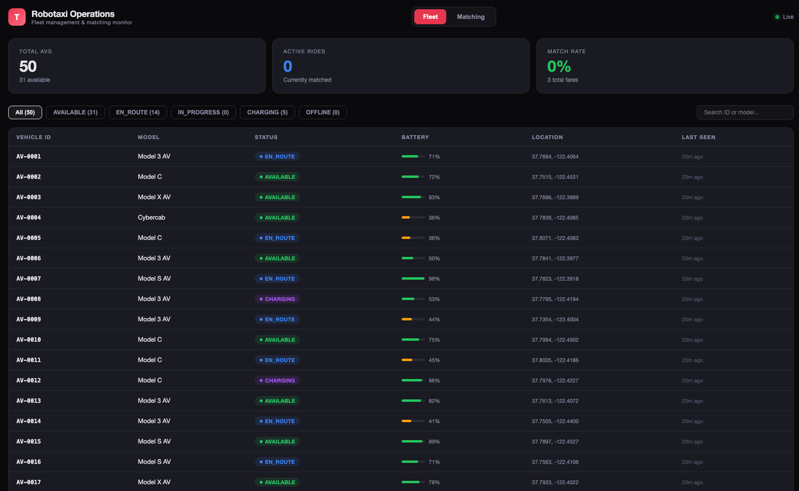
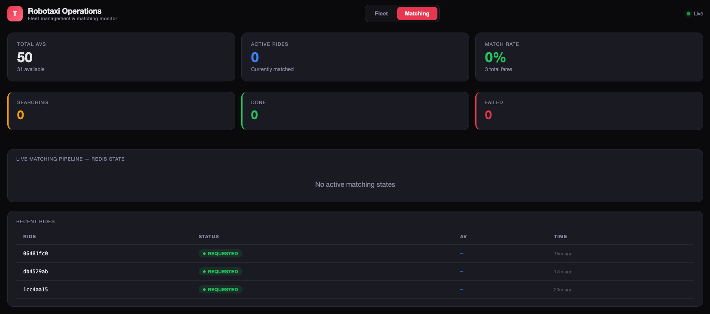

# 🚕 Robotaxi Matching System

A production-style ride-matching platform for autonomous vehicles, built with **Go**, **PostgreSQL**, and **Redis**. Implements real-time AV fleet management, distributed matching with consistency guarantees, and a live operations dashboard.

## Architecture 

```
┌──────────┐    HTTP     ┌──────────────┐     ┌──────────┐
│  Client   │───────────▶│  Gin Server  │────▶│ Postgres │
│ Dashboard │◀──── WS ───│  (Ride Svc)  │     │ Fare/Ride│
└──────────┘            └──────┬───────┘     └──────────┘
                               │
                    ┌──────────┴──────────┐
                    ▼                      ▼
            ┌──────────────┐     ┌────────────────┐
            │   Matching   │     │ Location Cache  │
            │   Service    │────▶│   (Redis GEO)   │
            │ (Redis state)│     │  GEOADD/SEARCH  │
            └──────┬───────┘     └────────────────┘
                   │
                   ▼
            ┌──────────────┐
            │  AV Gateway  │ ◀── gRPC (simulated)
            │  (dispatch)  │
            └──────────────┘
```

## Key Design Decisions

| Problem | Solution |
|---------|----------|
| High-frequency location updates (~2M writes/sec at scale) | Redis `GEOADD` / `GEOSEARCH` in-memory store |
| Proximity queries on geo coordinates | Redis GEO commands instead of B-tree index on lat/lng |
| Peak demand traffic spikes | Queue buffer between Ride Service and Matching Service |
| Prevent 1 ride → multiple AVs assigned | Per-ride Redis lock (`SETNX`) + matching state with cursor |
| Prevent 1 AV → multiple rides | PostgreSQL partial unique index on `rides(av_id)` |
| Stateless matching workers | Shared matching state stored in Redis |

## Screenshots

### Fleet management
Real-time view of 50 autonomous vehicles with status, battery level, GPS coordinates, and filtering.



### Matching monitor
Live matching pipeline showing Redis state, ride status, and recent ride history.



## Tech Stack

- **Go 1.22** + Gin — HTTP server and API
- **PostgreSQL 16** — Fare, Ride, AV persistence
- **Redis 7** — Location cache (GEO), matching state, distributed locks
- **WebSocket** — Real-time push to dashboard (gorilla/websocket)
- **Prometheus** — Metrics instrumentation (`/metrics` endpoint)
- **Docker Compose** — One-command full-stack deployment

## Quick Start

```bash
# Prerequisites: Docker Desktop running

# 1. Clone and start
git clone https://github.com/yulo-dev/robotaxi-matching-system.git
cd robotaxi-matching-system
docker compose up --build -d

# 2. Seed demo data (50 AVs + sample ride)
go run scripts/seed.go

# 3. Open dashboard
open http://localhost:8080/dashboard/
```

## API Endpoints

### Ride flow

```bash
# Step 1: Get fare estimate
curl -X POST http://localhost:8080/api/fare \
  -H "Content-Type: application/json" \
  -d '{
    "rider_id": "user-001",
    "pickup_location": {"lat": 37.7749, "lng": -122.4194},
    "destination": {"lat": 37.7849, "lng": -122.4094}
  }'

# Step 2: Request ride (triggers async matching)
curl -X POST http://localhost:8080/api/rides \
  -H "Content-Type: application/json" \
  -d '{"fare_id": "FARE_ID_FROM_STEP_1"}'

# Step 3: AV responds to dispatch
curl -X POST http://localhost:8080/api/dispatch/decision \
  -H "Content-Type: application/json" \
  -d '{"ride_id": "RIDE_ID", "av_id": "AV-0001", "decision": "ACCEPT"}'
```

### Fleet management

```bash
# Register an AV
curl -X POST http://localhost:8080/api/av/register \
  -H "Content-Type: application/json" \
  -d '{"id":"AV-0051","model":"Cybercab","status":"AVAILABLE","battery_pct":95,"location":{"lat":37.78,"lng":-122.42}}'

# Update AV location (simulates periodic GPS heartbeat)
curl -X POST http://localhost:8080/api/av/location \
  -H "Content-Type: application/json" \
  -d '{"av_id":"AV-0001","location":{"lat":37.775,"lng":-122.418},"status":"AVAILABLE","battery_pct":88}'

# List all AVs / Dashboard stats / Matching states
curl http://localhost:8080/api/avs
curl http://localhost:8080/api/dashboard/stats
curl http://localhost:8080/api/matching/states
```

### Monitoring

```bash
# Prometheus metrics
curl http://localhost:8080/metrics | grep robotaxi_

# Health check
curl http://localhost:8080/health

# WebSocket endpoint
wscat -c ws://localhost:8080/ws
```

## Database Schema

```sql
CREATE TABLE fares (
  id UUID PRIMARY KEY,
  rider_id TEXT NOT NULL,
  source_lat DOUBLE PRECISION, source_lng DOUBLE PRECISION,
  dest_lat DOUBLE PRECISION, dest_lng DOUBLE PRECISION,
  price NUMERIC(10,2),
  created_at TIMESTAMPTZ, expires_at TIMESTAMPTZ
);

CREATE TABLE rides (
  id UUID PRIMARY KEY,
  fare_id UUID REFERENCES fares(id),
  rider_id TEXT,
  source_lat DOUBLE PRECISION, source_lng DOUBLE PRECISION,
  dest_lat DOUBLE PRECISION, dest_lng DOUBLE PRECISION,
  status TEXT,  -- REQUESTED → MATCHING → DRIVER_ASSIGNED → IN_PROGRESS → COMPLETED
  av_id TEXT,
  created_at TIMESTAMPTZ, updated_at TIMESTAMPTZ
);

-- Consistency guard: prevents 1 AV assigned to multiple active rides
CREATE UNIQUE INDEX uniq_active_ride_per_av
  ON rides(av_id)
  WHERE status IN ('DRIVER_ASSIGNED', 'IN_PROGRESS');

CREATE TABLE avs (
  id TEXT PRIMARY KEY,
  model TEXT, status TEXT, battery_pct FLOAT,
  lat DOUBLE PRECISION, lng DOUBLE PRECISION,
  last_seen TIMESTAMPTZ
);
```

## Matching Flow

```
Redis key:   match:ride:<ride_id>
Redis value: {"candidates":["AV-0003","AV-0017","AV-0042"], "cursor":0, "status":"SEARCHING"}
```

1. `GEOSEARCH` finds nearby AVs within 10km radius
2. Filter to `AVAILABLE` status via Redis hash lookup
3. Create matching state in Redis, cursor = 0
4. Dispatch to `candidates[cursor]` via AV Gateway
5. On `REJECT` → increment cursor, dispatch next candidate
6. On `ACCEPT` → set status = `DONE`, assign AV to ride in PostgreSQL
7. Unique index enforces 1:1 mapping — duplicate assignment triggers re-match
8. Per-ride Redis lock (`SETNX` with TTL) prevents concurrent worker conflicts

## Prometheus Metrics

| Metric | Type | Description |
|--------|------|-------------|
| `robotaxi_rides_requested_total` | Counter | Total ride requests |
| `robotaxi_rides_matched_total` | Counter | Successful matches |
| `robotaxi_rides_failed_total` | Counter | Failed matches |
| `robotaxi_match_latency_seconds` | Histogram | Time to complete matching |
| `robotaxi_dispatch_attempts_total` | Counter | Dispatch commands sent |
| `robotaxi_dispatch_rejections_total` | Counter | AV rejections |
| `robotaxi_unique_index_violations_total` | Counter | Duplicate assignment blocks |
| `robotaxi_lock_contentions_total` | Counter | Per-ride lock conflicts |
| `robotaxi_http_request_duration_seconds` | Histogram | API latency by endpoint |

## Testing

```bash
# Unit tests (no external deps)
make test-unit

# Integration tests (requires Redis)
make test-integration

# All tests
make test
```

## Project Structure

```
├── cmd/server/main.go            # Entry point, wires services
├── internal/
│   ├── api/handlers.go           # Gin route handlers
│   ├── api/handlers_test.go      # API unit tests
│   ├── db/store.go               # PostgreSQL queries
│   ├── location/service.go       # Redis GEO location cache
│   ├── location/service_test.go  # GEO search tests
│   ├── matching/service.go       # Matching engine + dispatch
│   ├── matching/service_test.go  # Matching state + lock tests
│   ├── middleware/metrics.go     # Prometheus instrumentation
│   ├── models/models.go          # Shared types
│   └── ws/hub.go                 # WebSocket hub
├── frontend/index.html           # Operations dashboard
├── scripts/seed.go               # Demo data seeder
├── Dockerfile
├── docker-compose.yml
├── Makefile
└── README.md
```

## Stopping

```bash
docker compose down        # stop containers
docker compose down -v     # stop + delete data
```
